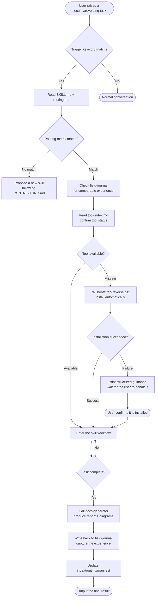
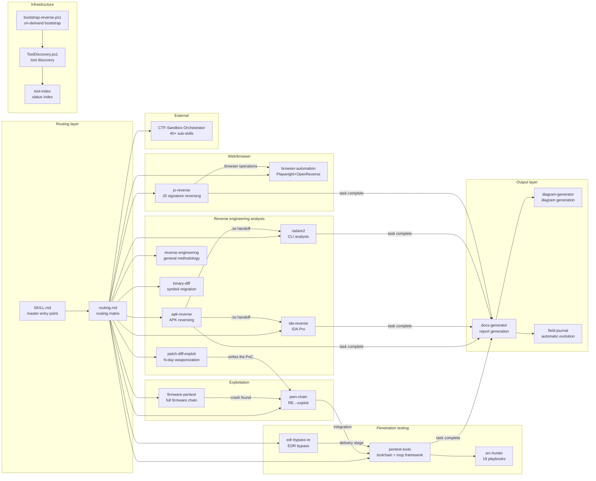
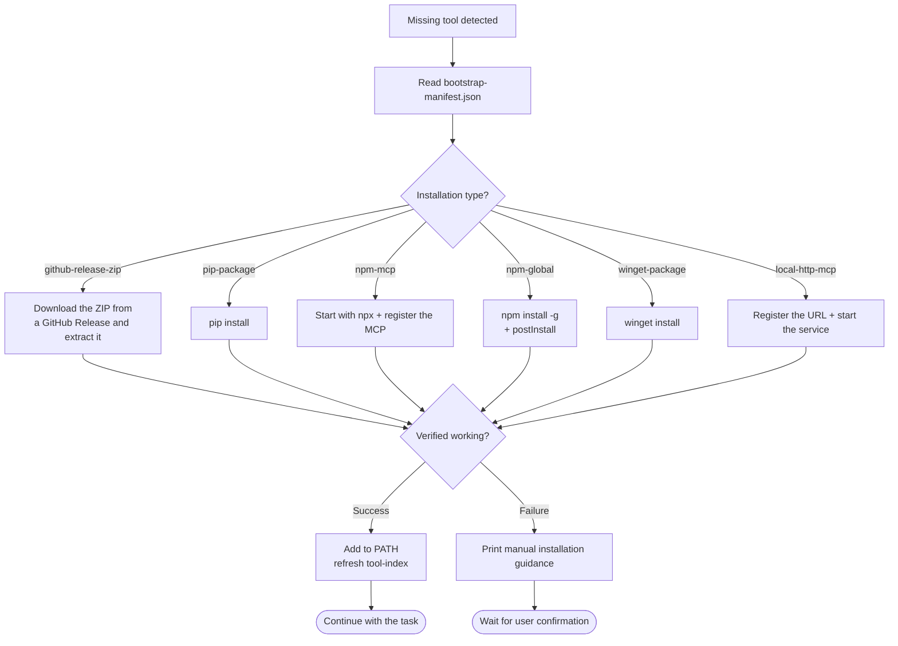
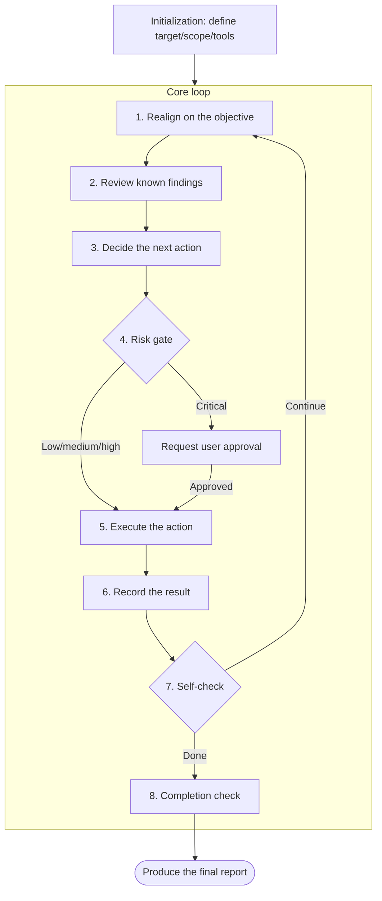
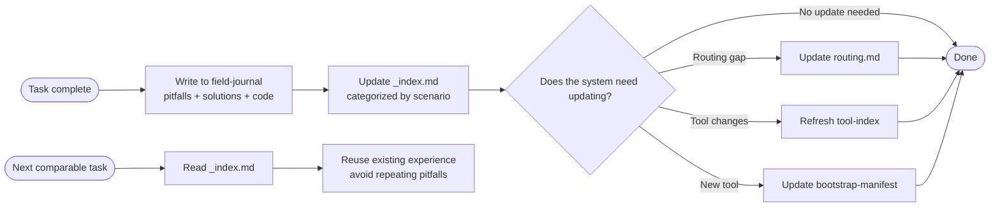
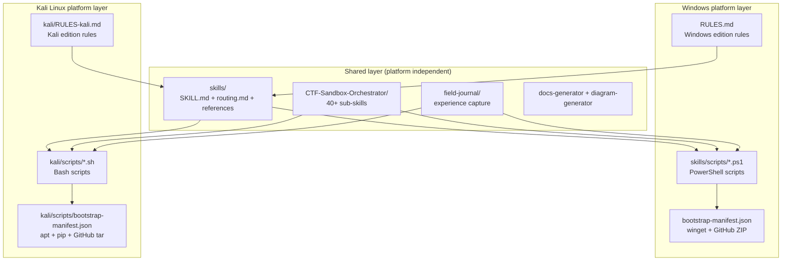
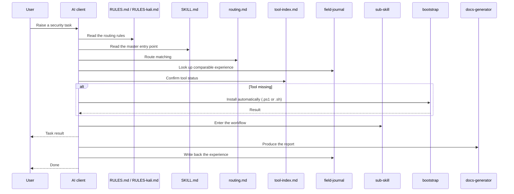

# System Architecture Diagrams

## Full Behavior Chain Flowchart

## Skills Module Relationship Diagram

## Bootstrap Self-Provisioning Flow

## Penetration Testing Loop

## Automatic Evolution Mechanism

## Multi-Platform Support Architecture

### Platform Selection Logic

| Environment | Rules file used | Scripts used | Package management |
|------|--------------|-----------|--------|
| Windows | `RULES.md` | `skills/scripts/*.ps1` | winget / GitHub Release ZIP |
| Kali Linux | `kali/RULES-kali.md` | `kali/scripts/*.sh` | apt / pip / npm / GitHub tar.gz |

### Characteristics of the Kali Edition

- **Many preinstalled tools**: nmap, sqlmap, hashcat, hydra, metasploit, radare2, binwalk, burpsuite and others need no bootstrap
- **Unified apt management**: no winget, no manual ZIP extraction
- **Native bash**: simpler scripts with no PowerShell dependency
- **Clean paths**: `/usr/bin/`, `/opt/`, `~/tools/`, no drive letters and no space-in-path issues

## File Read Sequence Diagram

