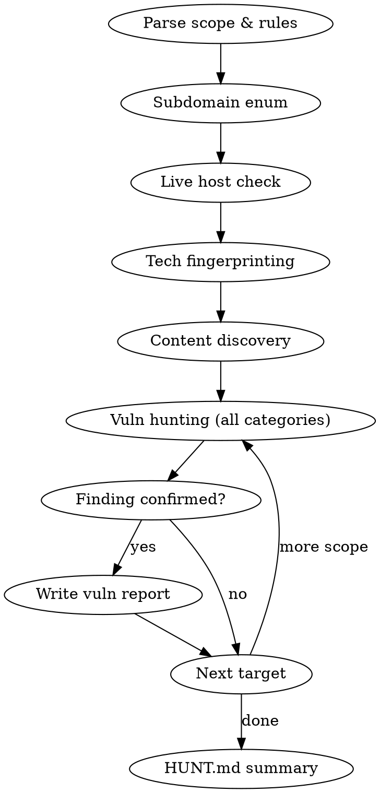

# Bug Bounty Hunt

## Overview

Full autonomous bug bounty workflow: parse scope → enumerate attack surface → fingerprint tech → hunt vulnerabilities → document every step and finding.

## Prerequisites Check

Before starting, verify tooling availability in this order:

1. **Hexstrike MCP** — preferred. Check with `/mcp list`. If `hexstrike` appears, use it for all recon and scanning.
2. **CLI tools fallback** — if hexstrike is unavailable (502, not listed), use whatever is installed: `subfinder`, `httpx`, `nuclei`, `nmap`, `ffuf`, `curl`, `waybackurls`, `gau`, `katana`, `nikto`.
3. **Passive only** — if neither is available, use `WebFetch` + `WebSearch` for passive fingerprinting only and note the limitation in HUNT.md.

Always document which toolchain was used in HUNT.md.

## Workspace Setup

When invoked, immediately create this structure in the working directory:

```
docs/
  ABOUT.md         # Program policy, disclosure rules, out-of-scope methods
  SCOPE.md         # In-scope domains/assets with severity and bounty info
HUNT.md            # Running log of every action + result
vuln/              # One file per confirmed finding
```

**If the user pastes program information (policy text, scope table, or both):**
- Parse it and write `docs/ABOUT.md` with the full policy, disclosure rules, safe harbor, and out-of-scope methods
- Parse it and write `docs/SCOPE.md` with a markdown table of all in-scope assets (domain, type, max severity, bounty eligibility)
- If only one is provided, create only that file
- Do this before any recon begins

**SCOPE.md table format:**
```markdown
# [Program Name] — Scope

## In-Scope Domains

| Domain | Type | Max Severity | Bounty | Added | Reports (Resolved %) |
|--------|------|-------------|--------|-------|----------------------|
| `*.example.com` | Domain | Critical | $500–$5,000 | Jan 1, 2026 | 12 (83%) |

> **Note:** [any wildcard or special coverage notes]
```

**HUNT.md header template:**
```markdown
# Hunt Log — [Program Name]
**Date:** [today]
**Toolchain:** [hexstrike MCP | CLI tools | passive only]
**Scope:** [list domains]

---
## Phase 1: Recon
...
```

Each vuln file: `vuln/[slug]-[YYYY-MM-DD].md`

## Workflow



## Phase 1: Recon

**For each in-scope domain (wildcard = enumerate subdomains first):**

1. **Subdomain enumeration** — `subfinder -d domain.com` or hexstrike equivalent. Log all discovered subdomains.
2. **Live host check** — `httpx` on all subdomains. Only continue with responsive hosts.
3. **Port scan** — `nmap -sV` on live hosts. Note non-standard ports.
4. **Tech fingerprinting** — detect frameworks, CMS, languages, CDN, WAF. Use `httpx -tech-detect` or Wappalyzer-style analysis of headers + body.
5. **Content discovery** — `ffuf` or `katana` for endpoints, JS files, API paths. Collect `robots.txt`, `sitemap.xml`, `.git`, `/.env` exposure.
6. **Historical URLs** — `waybackurls` or `gau` for archived endpoints.

Log every command + output summary in HUNT.md under `## Phase 1: Recon`.

## Phase 2: Vulnerability Hunting

Work through all categories below for each target. Skip categories explicitly excluded by the program's out-of-scope rules.

### Injection
- SQL injection: test all query parameters, form fields, JSON bodies. Try `'`, `"`, `1 OR 1=1`, error-based, blind time-based.
- Command injection: fields that look like filenames, shell args, `ping`, `nslookup` patterns. Try `;id`, `|id`, backtick.
- Template injection: `{{7*7}}`, `${7*7}`, `<%= 7*7 %>`. Look for reflected math in response.
- Header injection: `Host`, `X-Forwarded-For`, `X-Original-URL`, `Referer` — test for SSRF and cache poisoning.

### XSS
- Reflected: every input that echoes in HTML. Payloads: `<script>alert(1)</script>`, `">`, encoded variants.
- Stored: profile fields, comments, notes, anything persisted and rendered.
- DOM-based: JS source/sink analysis in downloaded JS files. Look for `innerHTML`, `document.write`, `eval`, `location.hash`.
- CSP check: note if CSP is present and whether it's bypassable.

### Authentication
- Login without credentials / broken auth flows.
- Password reset link reuse, token predictability.
- Account enumeration via timing or response differences.
- MFA bypass: skip step, replay OTP, race condition.
- JWT: `alg:none`, weak secret, kid injection, algorithm confusion.

### Authorization / IDOR
- Replace IDs in URLs, request bodies, headers. Try sequential, UUID, encoded IDs.
- Cross-account access: create two test accounts, verify resource isolation.
- Privilege escalation: access admin endpoints from regular user.
- HTTP method abuse: `GET` → `POST`/`PUT`/`DELETE` on restricted endpoints.

### CSRF
- State-changing operations: check for `SameSite`, CSRF tokens, `Origin`/`Referer` validation.
- JSON CSRF: `Content-Type: text/plain` with JSON body.
- Login CSRF: fix session before authentication.

### Race Conditions
- Apply coupon/discount codes concurrently.
- Concurrent withdrawals or transfers.
- Vote/like multiple times via parallel requests.
- Use `ffuf` with `-rate` or `curl --parallel` for concurrent requests.

### Session Management
- Session fixation: set session ID before login, check if it changes post-auth.
- Session expiration: test token validity after logout.
- Cookie flags: `Secure`, `HttpOnly`, `SameSite` — note missing flags (only report if exploitable, per program rules).
- Token entropy: collect multiple tokens, check for patterns.

### Cryptography
- Secrets in JS source, HTML comments, API responses (`api_key`, `secret`, `password`, `token`).
- Predictable reset tokens, short/low-entropy tokens.
- Sensitive data in logs or error responses.
- Insecure direct object reference via encrypted/encoded IDs (decrypt/decode and tamper).

### Information Disclosure
- Verbose error messages: stack traces, SQL errors, file paths.
- Directory listing enabled.
- Debug endpoints: `/debug`, `/actuator`, `/metrics`, `/_debug`, `/phpinfo.php`.
- Source map files (`main.js.map`).
- Timing attacks on user enumeration.

### DoS (only if explicitly in scope — check program rules)
- Unbounded pagination, missing rate limits on heavy endpoints.
- ReDoS: complex regex fields with pathological input.
- File upload size limits.
- **Never send actual DoS traffic** — only document the pattern as a logic finding.

### Business Logic
- Negative prices, zero quantities, integer overflow in cart/pricing.
- Skip workflow steps (e.g., skip payment, go straight to order confirmation URL).
- State machine violations: access post-X state without completing X.
- Coupon/referral abuse, free tier limit bypass.

## Documenting Each Finding

When a finding is confirmed, immediately:

1. Log it in HUNT.md under `## Findings` with severity and one-line description.
2. Create `vuln/[vuln-type]-[target]-[date].md` using the template below.

Each vuln file contains two sections: internal notes at the top, then the ready-to-submit HackerOne report below a divider.

```markdown
# [Vuln Type] — [Target]
**Severity:** Critical / High / Medium / Low  
**Date Found:** [YYYY-MM-DD]  
**URL/Endpoint:** [exact URL]  
**Parameter/Field:** [what was vulnerable]

## Internal Notes
One paragraph — what is it, why does it exist, and any context not suitable for the report.

## Evidence
[Raw request/response, payload used, tool output]

## Remediation
Brief fix recommendation.

---
## HackerOne Report

**Title:** [Concise, specific — e.g. "Password Reset Tokens Indexed by Public Web Archives — Potential Account Takeover"]

**Asset:** [domain from program scope — e.g. `mheducation.com`]

**Weakness:** [e.g. Information Disclosure / Broken Authentication / IDOR / XSS]

**Severity:** Critical / High / Medium / Low

**Description:**

## Summary:
[One paragraph. What is the vulnerability and why does it exist?]

## Steps To Reproduce:

1. [Exact, reproducible step]
2. [Exact, reproducible step]
3. [Observe: what response/behavior confirms the issue]

## Supporting Material/References:

* [Evidence: request, response snippet, command output, URL]
* [Additional references if relevant]

**Impact:**
- [Sharpest consequence first — what an attacker gets, in concrete terms: data type, record count, account access.]
- [Next consequence — a distinct exploitation path or downstream abuse, not a rephrasing of the first bullet.]
- [Regulatory/compliance angle if applicable — LGPD/GDPR/PCI, named plainly.]
- [Scale/reach — how many users, accounts, or records, stated as a fact not an adjective.]
- [Explicit boundary — what is *not* exposed/reachable, if relevant to severity calibration.]
```

**Title guidelines:**
- Lead with the vulnerability class, end with the impact
- Good: `Unauthenticated Spring Boot Actuator /info Exposes Build and Environment Metadata`
- Good: `Password Reset Tokens Indexed by Public Web Archives — Potential Account Takeover`
- Bad: `Information disclosure on openapi subdomain`

**Steps to Reproduce guidelines:**
- Must be copy-pasteable. Include exact curl commands or tool invocations where possible.
- Triagers should be able to reproduce in under 5 minutes without guessing.
- Include expected response (status code, body excerpt) so they know what "success" looks like.

**Impact guidelines:**
- **Direct bullet points, never prose paragraphs.** One consequence per bullet, no topic-sentence-plus-elaboration structure.
- Each bullet leads with the claim, not the setup — cut "An attacker could potentially..." down to the concrete outcome.
- No filler bullets restating the vulnerability itself; every bullet must be a distinct consequence.
- Keep bullets to one or two sentences. If a bullet needs a third sentence, it's two bullets.
- Bold the 2-4 word core of each bullet (the data type or outcome) so the section scans in seconds.

**Impact must be DEMONSTRATED, not asserted — the #1 cause of Not Applicable closures.**

Programs close reports with: *"we were unable to identify any security impact [...] a submission must demonstrate an impact that can have an effect on the customer, the application/website, or its users. Submissions should always answer the question, 'as an attacker I could', with a suitable demonstration of such."*

Before writing the Impact section, every bullet must pass:

> "As an attacker I could **[action]**, resulting in **[harm to customer/app/users]**, demonstrated by **[captured evidence in this report]**."

- **Every impact bullet must trace to captured evidence already shown in Steps To Reproduce.** If a consequence is not backed by a request/response, decrypted output, screenshot, or callback hit in this report, delete the bullet.
- **Ban speculative verbs** — "could", "may", "potentially", "might", "would allow" — unless the sentence also points at the captured proof. Speculation in the Impact section is what triage reads as "no demonstrated impact".
- **Show the outcome, not the reachability.** Reaching a sink is setup; what the attacker ends up holding is impact.
- **Verify the victim is real** — not your own account, not a shared fixture/test record. A record identical across two unrelated accounts is a fixture, not a leak.
- **State the ceiling explicitly** in a final bullet: what this does *not* achieve. Overclaiming discredits the whole report; a stated boundary makes the demonstrated part credible.
- **If impact cannot be demonstrated, do not file it as a vulnerability.** File it as an observation, or keep testing until it can. See the Impact Demonstration Gate in the `bug-bounty` skill for the full checklist and the Not-Applicable-without-exploit category list (missing headers, cookie flags, source maps, untested keys, enumerable IDs with no data pulled, etc.).

## Out-of-Scope Safeguards

Before testing any host or method:
- Confirm the domain is in scope (not in explicit out-of-scope list).
- If program excludes a test method (e.g., DoS, open redirect without impact), skip it entirely.
- If PII is encountered, stop activity on that endpoint and log it in HUNT.md immediately.
- Do not test third-party services, vendors, or SSO providers not owned by the program.

## HUNT.md Running Log Format

Every action gets logged:

```markdown
### [HH:MM] Subdomain enum — mheducation.com
**Command:** subfinder -d mheducation.com
**Results:** 47 subdomains found. Live: 23.
Notable: portal.mheducation.com, api.mheducation.com, admin-internal.mheducation.com

### [HH:MM] Tech fingerprint — portal.mheducation.com
**Stack:** React frontend, Node.js API, Cloudflare WAF
**Interesting:** X-Powered-By: Express, /api/v2/ prefix on all endpoints

### [HH:MM] IDOR test — /api/v2/users/{id}
**Payload:** Changed id from 10042 to 10041
**Result:** 200 OK, returned another user's profile data → CONFIRMED IDOR
→ See vuln/idor-api-users-2026-05-16.md
```

## Lessons & Improvements

### Always run gau on high-value subdomains, not just apex domains
Running `gau` only on the apex domain (e.g. `mheducation.com`) misses endpoint-specific
historical URLs. Run it separately on subdomains that handle auth, accounts, or APIs:

```
echo "accounts.mheducation.com" | gau --blacklist png,jpg,gif,jpeg,css,woff
echo "api.mheducation.com" | gau --blacklist png,jpg,gif,jpeg,css,woff
```

Priority targets: anything with `accounts`, `api`, `auth`, `login`, `pay`, `admin` in the name.

### Hunt for JS source maps on every live host
Source maps (`.js.map`) expose original pre-minified source code — endpoints, internal
comments, and occasionally credentials. Add this after content discovery for every live host:

```
ffuf -u https://TARGET/FUZZ -w wordlists/sourcemaps.txt -e .map
# or check known bundle names from the HTML source + .map extension
```

Common locations: same path as the JS bundle with `.map` appended, `/static/js/`, `/assets/`.

## Completion

When all scope domains are processed, add a `## Summary` section to HUNT.md:
- Total subdomains found
- Total live hosts tested  
- Findings per severity
- Domains with no findings
- Recommended next steps
